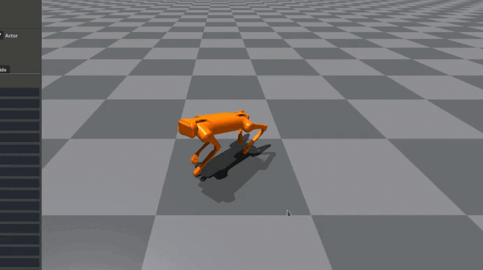
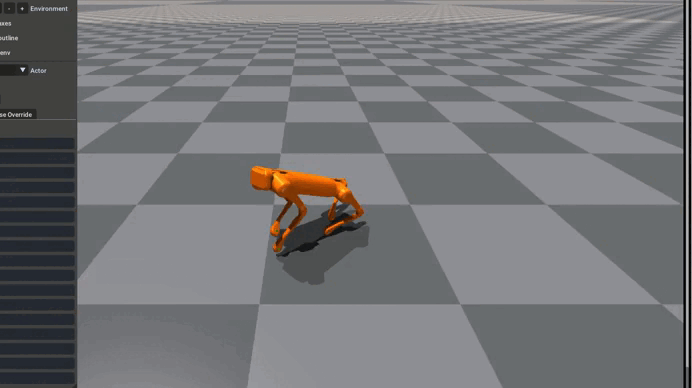
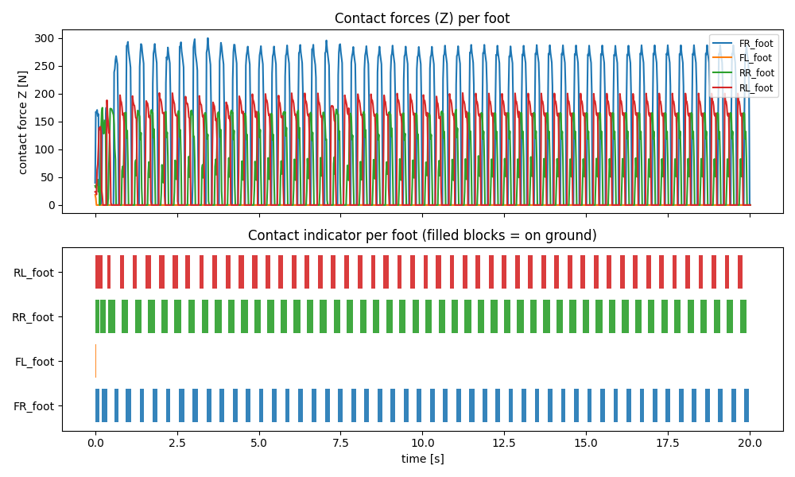
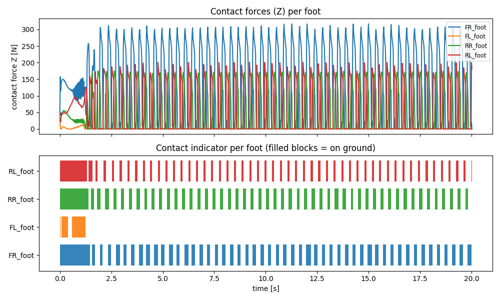
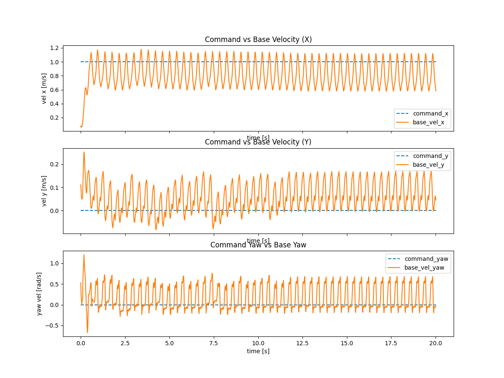
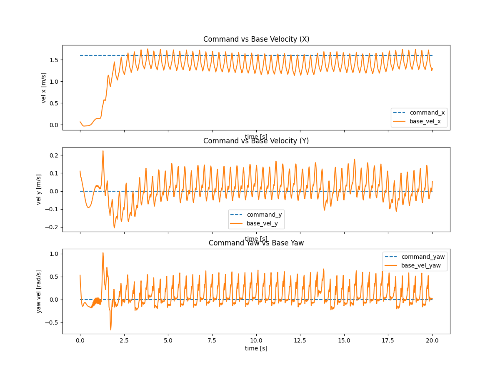

# Курсовая работа по теме: Дообучение BC политик ходьбы четырехногого робота

## Участники
- Царицин Антон 
- Недойводин Кирилл 
- Пономарев Александр
 

## Описание исследования
Проект посвящён обучению политики ходьбы для четвероногого робота (Unitree Aliengo) в Isaac Gym. Базовая политика (AMP/BC) уверенно ходит до ~1.1 м/с. Residual-политика обучается добавлять корректирующее действие к базе, чтобы расширить диапазон скоростей вперёд/вбок и сохранить устойчивый трёхлапый паттерн. Репозиторий содержит:
- Конфиги задач (база и residual) и скрипты запуска/обучения.
- Реализацию ActorCriticResidual с замороженной базой и обучаемой residual-головой.
- PPO-вариант с KL к базе и L2 на residual, логированием метрик и параметров запуска.
- Скрипты инференса с ручной подачей команд и визуализацией трекинга скоростей/контактов.

Дополнительно: в `datasets/` лежат данные для AMP, в `logs/` — чекпоинты обученных моделей (см. ниже).

## Теория (AMP / BC база)

- **AMP (Adversarial Motion Prior):** дискриминатор отличает expert-траектории mocap от траекторий политики; его выход используется как dense-награда.

$$ r_{\text{AMP}} = \alpha \left( 1 - \tfrac{1}{4} (D(s,s') - 1)^2 \right), \qquad D = \text{Discr}(s,s') $$

Используется градиентный штраф на экспертных сэмплах.

- **PPO с AMP:** стандартный clipped surrogate + value loss + entropy bonus; преимущества считаются через GAE.

- **Источники данных:** mocap / video JSON (позиции, кватернионы, скорости), нормализуются и подмешиваются в AMP replay buffer.

- **Инициализация:** эпизоды могут стартовать из AMP reference-кадров (reference state initialization) для стабилизации поз.

---

## Теория (Residual RL)

- **Итоговое действие:**

$$ a = \mu_{\text{base}}(s) + \mu_{\text{res}}(s) + \varepsilon, \qquad \varepsilon \sim \mathcal{N}(0, \sigma_{\text{res}}^2) $$

Базовая политика заморожена, стохастичность добавляется только в residual.

- **KL-дивергенция к базовой политике**  
(активируется при высокой команде скорости):

$$ \|v_{\text{cmd},xy}\| > v_{\text{thr}} $$

$$ L_{\text{KL}} = \mathbb{E}_{\text{mask}}\!\left[\sum_i \left( \log \frac{\sigma_i}{\sigma_i^b} + \frac{(\sigma_i^b)^2 + (\mu_i^b - \mu_i)^2}{2\sigma_i^2} - \tfrac{1}{2} \right) \right] $$

- **L2-регуляризация residual** (ограничивает величину поправки):

$$ L_{L2} = \mathbb{E}\!\left[\|\mu - \mu^b\|_2^2\right] = \mathbb{E}\!\left[\|\mu_{\text{res}}\|_2^2\right] $$

- **Итоговый лосс residual-обучения:**

$$ L = L_{\text{PPO}} + \lambda_{\text{KL}} L_{\text{KL}} + \lambda_{L2} L_{L2} $$

$$ L_{\text{PPO}} = L_{\text{clip}} + c_1 L_{\text{value}} - c_2 L_{\text{entropy}} $$

- **Warmup-стратегия:**

$$ \sigma_{\text{res}} \uparrow, \qquad \lambda_{\text{KL}},\; \lambda_{L2} \downarrow $$

$$ \text{after warmup: } \sigma_{\text{res}},\; \lambda_{\text{KL}},\; \lambda_{L2} \rightarrow \text{base values} $$

- **Диапазон команд residual-обучения** (без curriculum):

$$ v_x \in [1.1,\;3.0], \qquad v_y \in [-1.5,\;1.5], \qquad \omega_z \in [-3.14,\;3.14] $$

Обучение проводится сразу в режиме высоких скоростей, где базовая политика деградирует.


## Установка и подготовка окружения (симуляция)
Проверено на Ubuntu 22.04, CUDA 12.x, Python 3.8.20, RTX 4060 8gb, 16 RAM. Isaac Gym лежит в `isaacgym/`.
1) Создать и активировать окружение:
```bash
conda env create -f environment.yml
conda activate mlr-project
```
2) Установить пакеты в editable-режиме (именно в таком порядке):
```bash
pip install -e rsl_rl
pip install -e legged_gym
pip install -e .
```

## Запуск и использование (симуляция)
- Обучение базовой residual-политики:
```bash
python legged_gym/scripts/train.py \
  --task aliengo_residual \
  --output_name <run_name> \
  --rl_device cuda:0 \
  --headless
# продолжение: --resume --load_run <run_name> --checkpoint <N>
```
- Инференс (ручные команды):
```bash
python legged_gym/scripts/play_manual.py \
  --task aliengo_residual \
  --output_name <run_name> \
  --load_run <run_name> \
  --checkpoint <N> \
  --headless
```
Скрипт логирует трекинг скоростей в `logs/vel_tracking.png` и графики по суставам/контактам.
- Тренировка базовой AMP-политики (пример):
```bash
python legged_gym/scripts/train.py \
  --task aliengo_amp \
  --output_name <run_name> \
  --rl_device cuda:0 \
  --headless
```
- Инференс базовой политики:
```bash
python legged_gym/scripts/play_manual.py \
  --task aliengo_amp \
  --output_name <run_name> \
  --load_run <run_name> \
  --checkpoint <N>
```
- Готовые модели из `logs/`:
  - База AMP (`logs/aliengo_amp/video_limp/model_25000.pt`):
    ```bash
    python legged_gym/scripts/play_manual.py \
      --task aliengo_amp \
      --output_name video_limp \
      --load_run video_limp \
      --checkpoint 25000 \
      --headless
    ```
  - Residual (`logs/aliengo_residual/residual_run_highspeed/model_2000.pt` или `model_20000.pt`):
    ```bash
    python legged_gym/scripts/play_manual.py \
      --task aliengo_residual \
      --output_name residual_run_highspeed \
      --load_run residual_run_highspeed \
      --checkpoint 20000 \   # или 2000 для раннего варианта
      --headless
    ```

## Деплой на реальном роботе (Aliengo)
1) Собрать SDK:
```bash
cd unitree_legged_sdk
rm -rf build && mkdir build && cd build
cmake ..
make
```
2) Терминал 1 — запустить LCM-источник позиций (обязательно от рута):
```bash
cd unitree_legged_sdk/build
sudo ./lcm_position  
```
3) Терминал 2 — запустить политику:
```bash
cd aliengo_gym_deploy/scripts
python deploy_policy.py \
  --policy-type residual \        # amp или residual
  --checkpoint <path_to_ckpt> \   # обязателен для residual
  --max-steps 10000 \             # шагов контроля
  --experiment-name <name>        # имя папки логов
```
При отсутствии `--checkpoint` для AMP используется `logs/aliengo_amp/video_limp/model_25000.pt` (если есть).
Примеры с готовыми весами:
- AMP (video_limp):
```bash
python deploy_policy.py \
  --policy-type amp \
  --checkpoint ../logs/aliengo_amp/video_limp/model_25000.pt \
  --device cpu \
  --max-vel 1.0 --max-yaw-vel 1.0 \
  --max-steps 8000 \
  --experiment-name amp_deploy_video_limp
```
- Residual (residual_run_highspeed, выберите 2000 или 20000):
```bash
python deploy_policy.py \
  --policy-type residual \
  --checkpoint ../logs/aliengo_residual/residual_run_highspeed/model_20000.pt \
  --device cpu \
  --max-vel 2.5 --max-yaw-vel 1.5 \
  --max-steps 8000 \
  --experiment-name residual_highspeed_deploy
```

## Описание полученных результатов
- Цель: расширить диапазон скоростей вперёд/вбок при сохранении устойчивого паттерна. База стабильна до ~1.1 м/с; residual включается только в диапазоне вне базовой политики.
- Артефакты:
  - Чекпоинты (пример): `logs/aliengo_amp/video_limp/model_25000.pt` (база), `logs/aliengo_residual/<run_name>/model_*.pt` (residual).
  - Графики трекинга скоростей: `logs/vel_tracking.png` (генерируется `play_manual.py`).
  - Параметры обучения: `logs/aliengo_residual/<run_name>/params.json`, метрики в `metrics.csv`.
- Сырые данные: видео-траектории для AMP в `datasets/video_motion_limp_aliengo/…`. Добавьте ссылку/описание облачной папки: … (путь/URL, что есть что).

## Демонстрации результатов 
- Видео-демо: [Google Drive](https://drive.google.com/drive/folders/10A-a_Jby4aLZVS-udS8JTLU7oZghfbjI?usp=sharing)  

Симуляция на разных скоростях:  
| Base 1.0 m\s | Residual 1.6 m\s | Finetuning (только награда за скорость)  |
|-------|-------|-------|
|  |  |  |

Сравнение результатов: 
| Base 1 m/s | Residual 1.6 m/s |
|----------|----------|
|  |  |

| Base 1 m/s | Residual 1.6 m/s |
|----------|----------|
|  |  |

Деплой на реальном роботе: 
| Base 1 m/s | Residual 1.6 m/s |
|----------|----------| 
|  |  |

## Результаты (кратко)
- База: стабильная ходьба до ~1.1 м/с.
- Residual: удержание устойчивости на более высоких скоростях (vx до 3 м/с, vy до ±1.5 м/с), снижение ошибки трекинга скоростей; KL/L2 удерживают поведение близким к базе в «базовом» диапазоне.

## Структура проекта
```
Imitation_from_video/
  README.md                
  environment.yml          <-- файл окружения (Conda)
  aliengo_gym_deploy/      <-- файлы для деплоя реального робота deploy_policy.py
  legged_gym/              <-- задачи, конфиги, скрипты запуска (train/play)
    envs/                  <-- среды (Aliengo AMP/residual и др.)
    scripts/               <-- play.py, play_manual.py, train.py, shell-скрипты
  rl/, rsl_rl/             <-- алгоритмы PPO/ResidualPPO, модули actor-critic
  datasets/                <-- AMP-траектории (локальные примеры)
  resources/ <-- модели, вспомогательные ресурсы, внешние зависимости
  logs/                    <-- чекпоинты обученных политик, метрики
  unitree_legged_sdk/      <-- SDK для работы с роботом
```
Папки `models/`, `data/` не используются явно; веса и датасеты лежат в `logs/` и `datasets/`.
